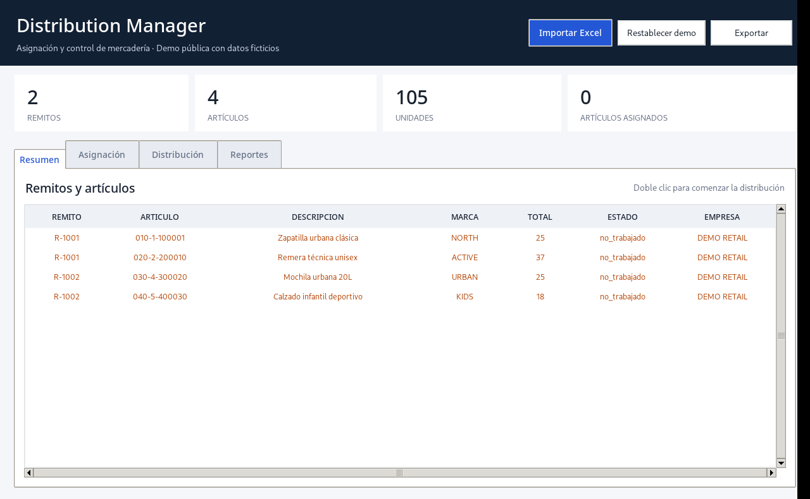
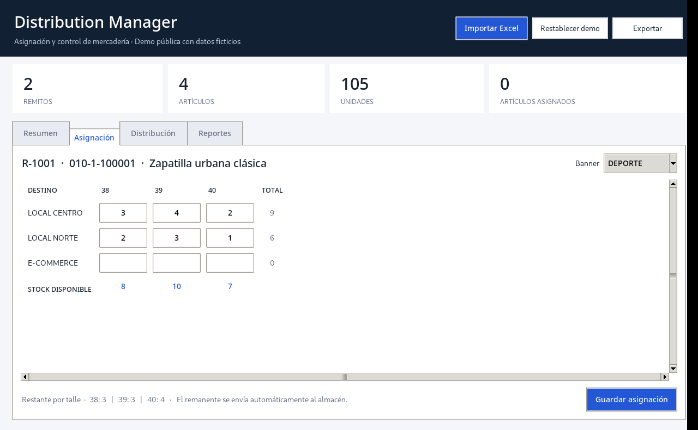
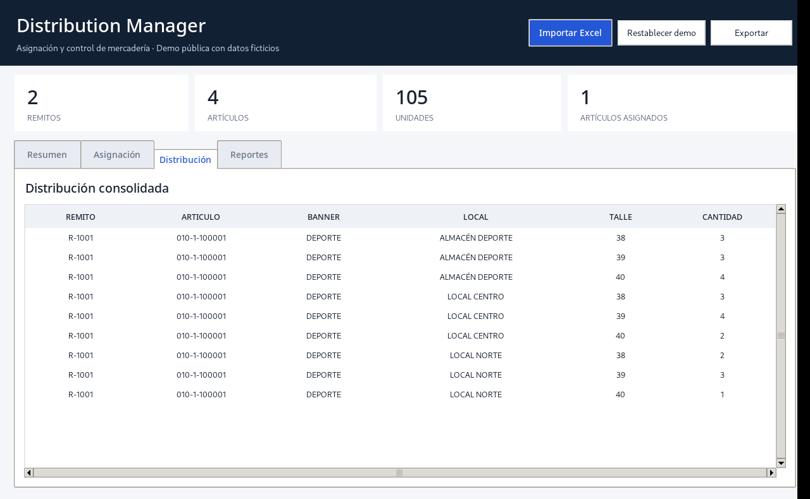
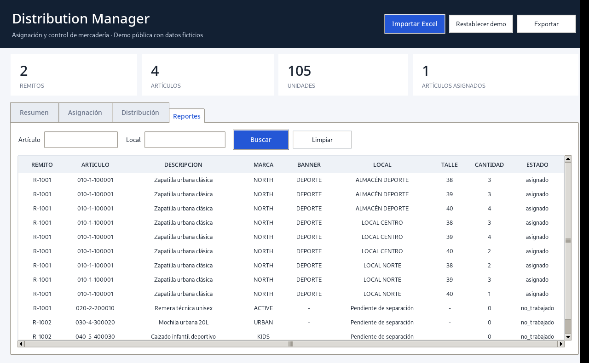

# Distribution Manager

**Aplicación de escritorio en Python para importar remitos, distribuir mercadería por local y talle, controlar remanentes y exportar reportes.**



> **Demo pública de portfolio.** El proyecto recrea, en una versión reducida y desacoplada, un flujo operativo real. Todos los nombres, artículos, empresas, remitos y cantidades son ficticios. No contiene credenciales ni información confidencial.

## El problema

La distribución manual de mercadería mediante planillas obliga a controlar artículos, talles, cantidades, destinos y sobrantes en archivos separados. Esto aumenta el trabajo operativo y facilita errores de carga o asignaciones por encima del stock disponible.

Distribution Manager concentra ese flujo en una sola aplicación: valida el Excel de entrada, muestra el stock por talle, impide sobreasignaciones, envía automáticamente el remanente al almacén correspondiente y mantiene trazabilidad en SQLite.

## Funcionalidades principales

- Importación y validación de remitos desde Excel.
- Resumen de remitos, artículos, marcas, cantidades y estados.
- Distribución por banner, local y talle.
- Control de stock en tiempo real y bloqueo de sobreasignaciones.
- Envío automático del sobrante al almacén del banner.
- Persistencia local con SQLite y claves foráneas.
- Reimportación segura: reemplaza el stock y elimina asignaciones incompatibles.
- Reportes con filtros por artículo y local.
- Exportación a Excel con encabezados, autofiltro y columnas ajustadas.
- Datos demo restablecibles desde la interfaz.
- Pruebas automatizadas para las reglas de negocio principales.

## Capturas

| Resumen ejecutivo | Asignación |
|---|---|
|  |  |

| Distribución | Reportes |
|---|---|
|  |  |

## Tecnologías

- Python 3.10+
- Tkinter / ttk
- pandas
- SQLite
- openpyxl
- pytest

## Arquitectura

```text
Excel de entrada
      │
      ▼
Validación con pandas
      │
      ▼
DistributionStore ─────► SQLite
      │                    │
      ▼                    ▼
Interfaz Tkinter       Consultas y estados
      │
      ▼
Reporte Excel formateado
```

La lógica de datos y las reglas de negocio están separadas de la interfaz en `data_store.py`, lo que permite probarlas sin abrir la aplicación gráfica.

## Estructura

```text
Distribution_Manager_Portfolio/
├── app.py
├── data_store.py
├── data/
│   └── remitos_demo.xlsx
├── docs/
│   ├── LINKEDIN.md
│   ├── OUTLIER_INTERVIEW.md
│   └── PROJECT_OVERVIEW_EN.md
├── screenshots/
│   ├── 01_dashboard.png
│   ├── 02_assignment.png
│   ├── 03_distribution.png
│   └── 04_reports.png
├── tests/
│   └── test_data_store.py
├── requirements.txt
├── requirements-dev.txt
├── .gitignore
├── LICENSE
└── README.md
```

La base `data/distribution_demo.db` se genera al ejecutar la aplicación y está excluida del repositorio.

## Instalación

```bash
git clone https://github.com/joabaigo10/Distribution-Manager.git
cd Distribution_Manager_Portfolio
python -m venv .venv
```

Windows:

```bash
.venv\Scripts\activate
python -m pip install -r requirements.txt
python app.py
```

Linux o macOS:

```bash
source .venv/bin/activate
python -m pip install -r requirements.txt
python app.py
```

## Formato del Excel

Columnas obligatorias:

- `Remito`
- `Family`
- `Size`
- `Quantity`
- `Descripcion`
- `Empresa`
- `Proveedor`
- `Factura`

Columna opcional: `Marca`.

`Quantity` debe contener números enteros no negativos. Las celdas obligatorias vacías son rechazadas con un mensaje descriptivo.

## Cómo probarlo

1. Ejecutar `python app.py`.
2. Abrir **Resumen** y hacer doble clic sobre un artículo.
3. Seleccionar un banner.
4. Ingresar cantidades por local y talle.
5. Guardar la asignación.
6. Revisar **Distribución** y **Reportes**.
7. Exportar el resultado a Excel.
8. Usar **Restablecer demo** para comenzar nuevamente.

## Pruebas

```bash
python -m pip install -r requirements-dev.txt
pytest -q
```

Las pruebas verifican importación, métricas, asignación de remanentes, bloqueo de sobrestock y reimportación segura.

## Decisiones técnicas

- **SQLite:** permite distribuir una demo autocontenida, sin configurar servidores ni credenciales.
- **Capa de datos separada:** evita acoplar SQL y reglas de negocio a los widgets.
- **Transacciones:** una importación o asignación se guarda de manera consistente.
- **Datos ficticios:** preservan la confidencialidad del sistema original.
- **Tkinter:** fue elegido por su disponibilidad en Python y su facilidad de despliegue en entornos Windows.

## Alcance de la versión pública

La solución original que inspiró esta demo incluye más reglas operativas, usuarios simultáneos, bloqueos, configuraciones por banner y reportes internos. Esta versión se redujo deliberadamente para mostrar el enfoque técnico sin publicar procesos ni información de la organización.

## Próximos pasos posibles

- Migración a FastAPI + React.
- Autenticación y permisos.
- Base centralizada para múltiples usuarios.
- Historial de auditoría.
- Empaquetado con instalador para Windows.
- Indicadores y gráficos operativos.

## Autor

**Joaquín Baigorria**

- LinkedIn: `https://www.linkedin.com/in/joaquin-baigorria-5224b0a0/`
- GitHub: `https://github.com/joabaigo10`
