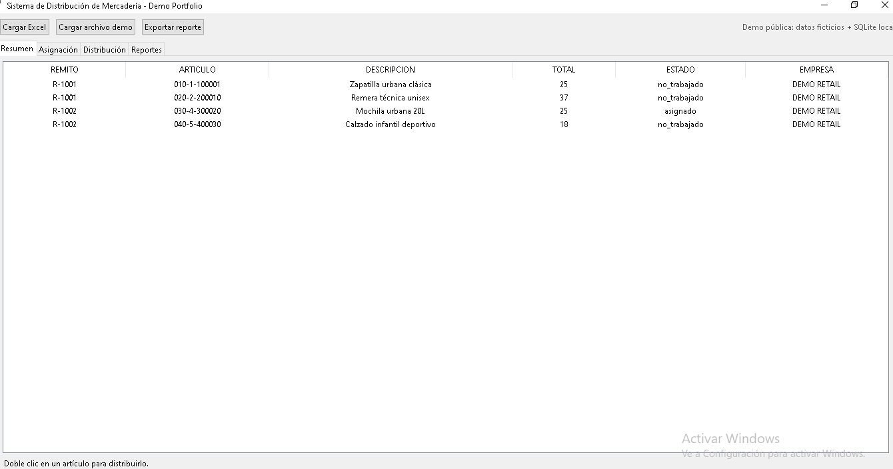
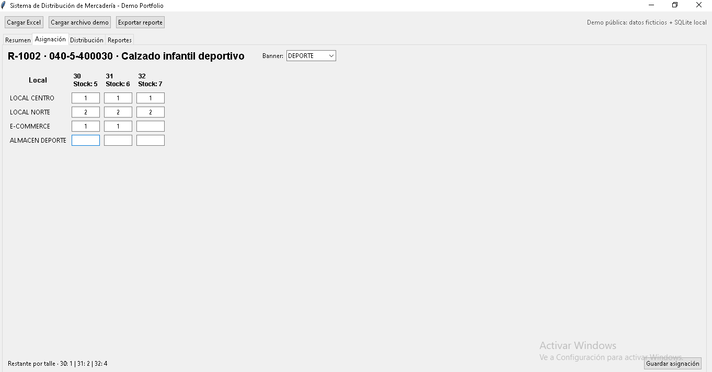
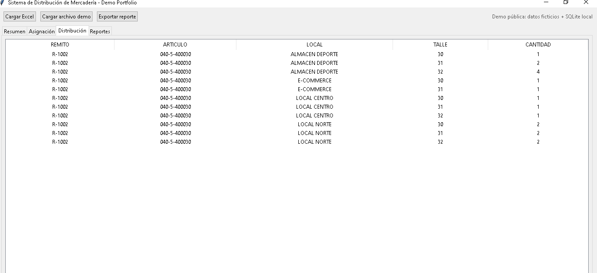
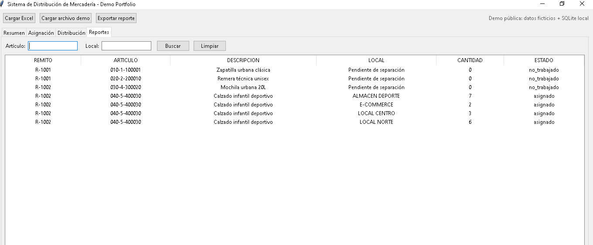

# Sistema de Gestión y Distribución de Mercadería — Demo Portfolio

Aplicación de escritorio desarrollada en **Python** para gestionar un flujo de distribución de mercadería entre locales, depósitos y canales de venta.

El sistema permite importar remitos desde Excel, consultar artículos, distribuir cantidades por talle y destino, controlar el stock restante, guardar la información en una base de datos local y exportar reportes.

> **Demo pública para portfolio.** Esta es una versión reducida de una herramienta interna. Todos los nombres, remitos, artículos, empresas y demás datos incluidos son ficticios. El proyecto no contiene credenciales, contraseñas, tokens, rutas privadas ni información real de ninguna empresa.

---

## Funcionalidades

- Importación de remitos desde Excel.
- Carga automática de un archivo demo.
- Resumen por remito y artículo.
- Visualización de descripción, cantidad total, estado y empresa.
- Distribución de unidades por local y talle.
- Cálculo automático del stock restante.
- Envío del sobrante al almacén correspondiente.
- Persistencia local con SQLite.
- Gestión de estados de artículos y remitos.
- Vista consolidada de la distribución realizada.
- Reportes con filtros por artículo y local.
- Exportación de reportes a Excel.

---

## Tecnologías utilizadas

- Python
- Tkinter
- pandas
- SQLite
- openpyxl

---

## Capturas

### Resumen

Vista general de los remitos, artículos, descripciones, cantidades y estados.



### Asignación

Distribución manual de cantidades por local y talle, con control automático del stock restante.



### Distribución

Vista consolidada de las unidades asignadas a cada destino.



### Reportes

Consulta de resultados con filtros por artículo y local.



---

## Estructura del proyecto

```text
Distribucion_Portfolio_Real/
├── data/
│   └── remitos_demo.xlsx
├── screenshots/
│   ├── 01_resumen.png
│   ├── 02_asignacion.png
│   ├── 03_distribucion.png
│   └── 04_reportes.png
├── app.py
├── requirements.txt
├── .gitignore
└── README.md
```

La base de datos SQLite se genera localmente al ejecutar la aplicación.

---

## Instalación

### 1. Clonar el repositorio

```bash
git clone URL_DEL_REPOSITORIO
cd Distribucion_Portfolio_Real
```

### 2. Crear un entorno virtual

```bash
python -m venv venv
```

### 3. Activar el entorno virtual

En Windows:

```bash
venv\Scripts\activate
```

En Linux o macOS:

```bash
source venv/bin/activate
```

### 4. Instalar las dependencias

```bash
python -m pip install -r requirements.txt
```

---

## Ejecución

```bash
python app.py
```

La aplicación carga automáticamente el archivo:

```text
data/remitos_demo.xlsx
```

cuando la base demo está vacía.

También se puede utilizar el botón **Cargar archivo demo** desde la interfaz.

---

## Formato del archivo Excel

El archivo debe contener las siguientes columnas:

- `Remito`
- `Family`
- `Size`
- `Quantity`
- `Descripcion`
- `Empresa`
- `Proveedor`
- `Factura`
- `Marca` — opcional

---

## Flujo recomendado para probar la aplicación

1. Abrir la pestaña **Resumen**.
2. Hacer doble clic en un artículo.
3. Elegir un banner.
4. Distribuir las cantidades por local y talle.
5. Guardar la asignación.
6. Revisar el resultado en **Distribución**.
7. Consultar y filtrar la información en **Reportes**.
8. Exportar el reporte a Excel.

---

## Datos y seguridad

Esta versión fue preparada exclusivamente para su publicación como proyecto de portfolio:

- No contiene contraseñas.
- No contiene tokens ni claves de API.
- No contiene rutas privadas del equipo original.
- No incluye datos reales de clientes, empleados o empresas.
- Utiliza remitos, artículos, nombres y cantidades ficticias.
- La base SQLite se genera y utiliza de forma local.
- Los archivos de base de datos y caché pueden excluirse mediante `.gitignore`.

---

## Objetivo del proyecto

Este proyecto demuestra experiencia práctica en:

- Desarrollo de aplicaciones de escritorio.
- Automatización de procesos operativos y administrativos.
- Manipulación y validación de datos.
- Integración con archivos Excel.
- Persistencia de información con SQLite.
- Diseño de interfaces orientadas a usuarios operativos.
- Control de stock y distribución por destino.
- Generación y exportación de reportes.

---

## Posibles mejoras

- Incorporar autenticación de usuarios.
- Agregar perfiles y permisos.
- Mejorar el diseño visual de la interfaz.
- Incorporar indicadores y gráficos.
- Agregar pruebas automatizadas.
- Empaquetar la aplicación como ejecutable.
- Migrar la solución a una versión web.

---

## Autor

**TU NOMBRE**

- LinkedIn: `URL_DE_TU_LINKEDIN`
- GitHub: `URL_DE_TU_GITHUB`
